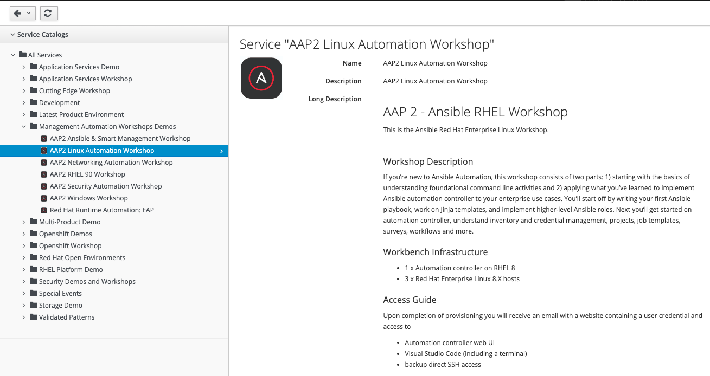
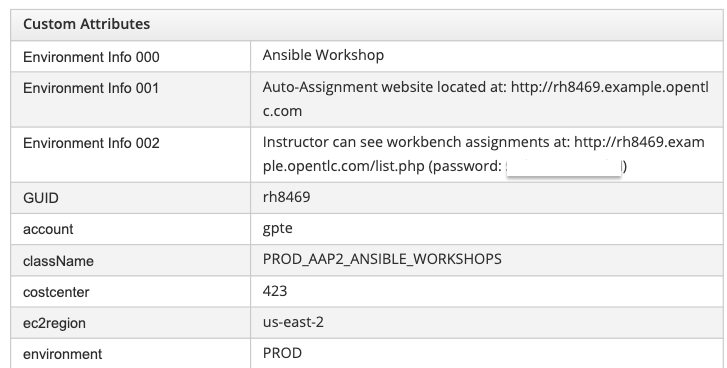
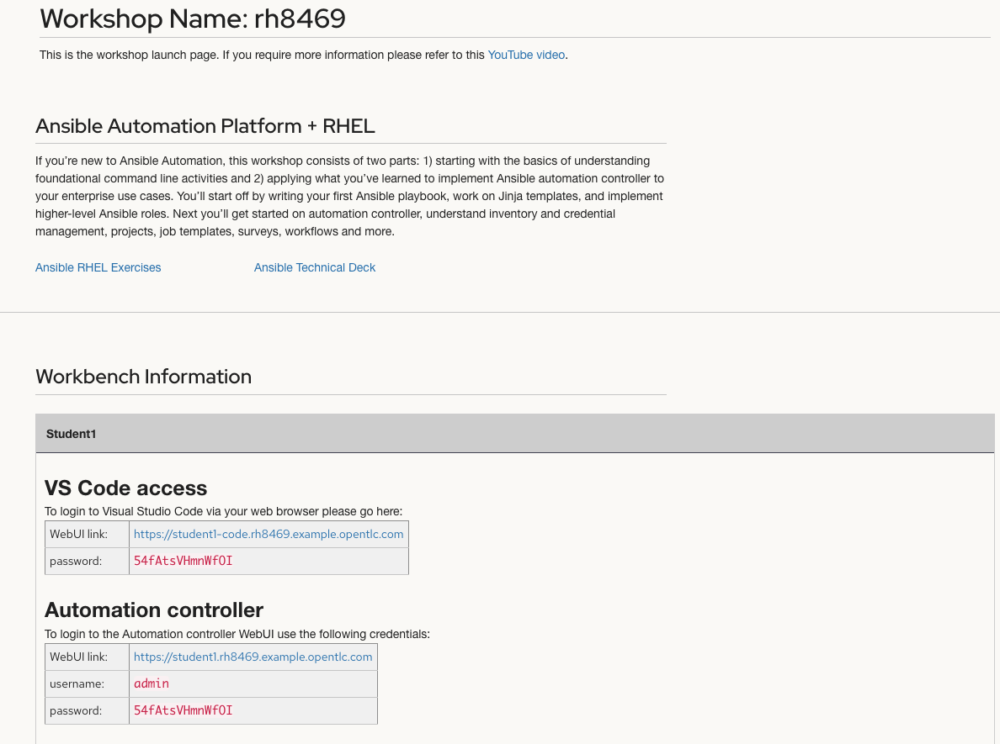
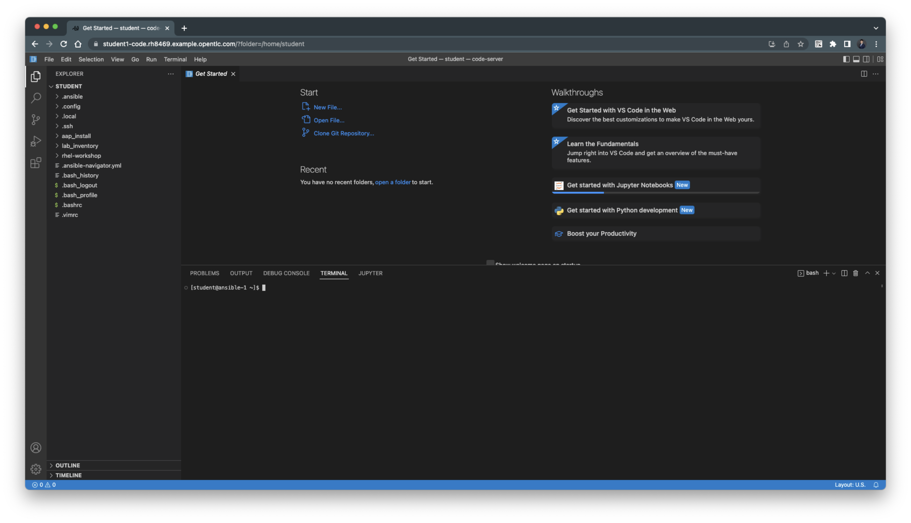
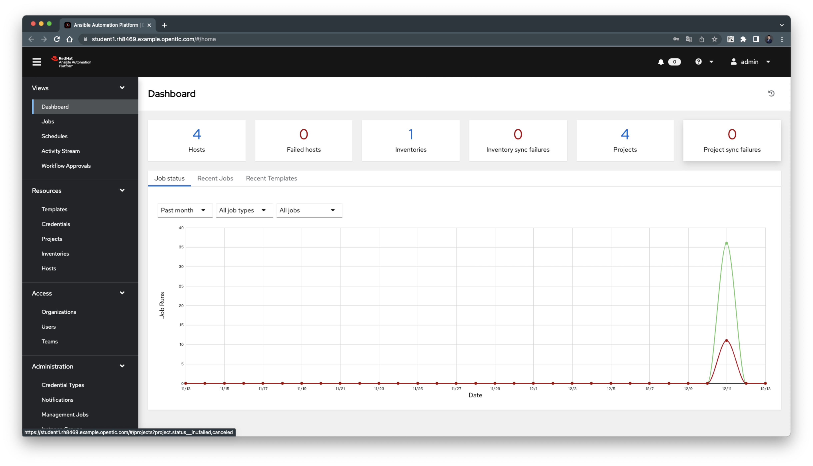
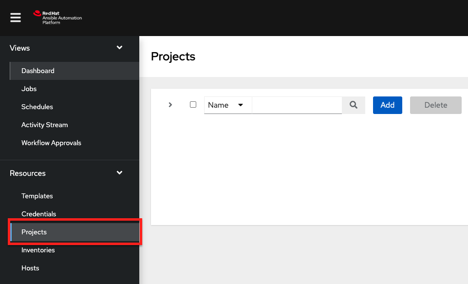
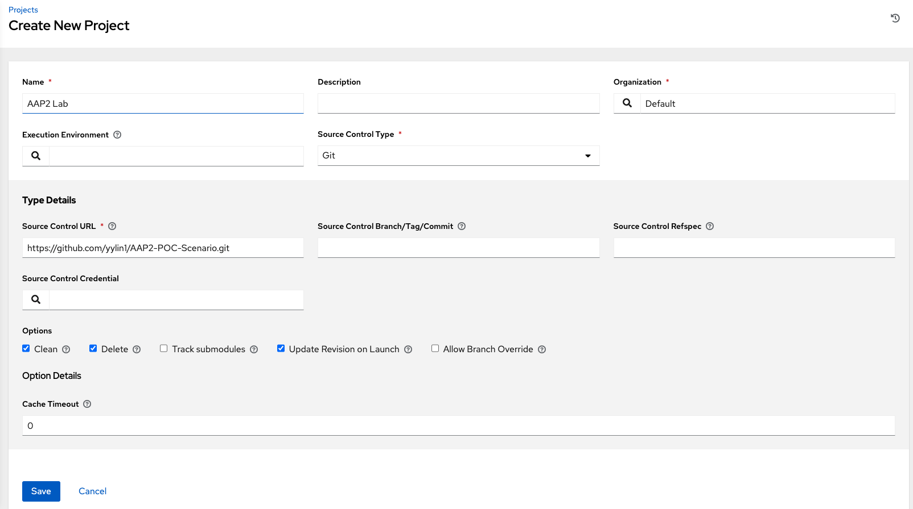
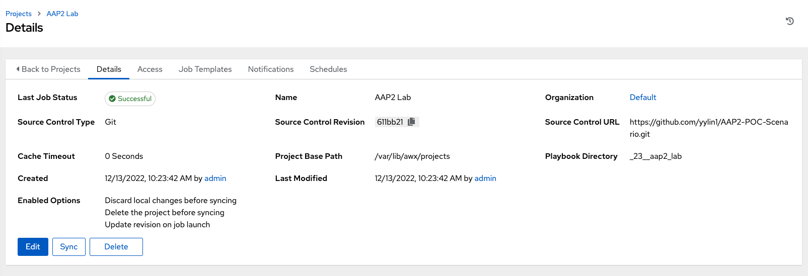

# LAB SETTINGS

## 環境

- RHPDS Red Hat Product Demo System
    -  https://rhpds.redhat.com/
        - 登入帳號 ${YOUR EMAIL ACCOUNT NAME}-redhat.com
        - Lab 主要基於 `AAP2 Linux Automation Workshop` 環境

- 註冊服務
```
Service Catalogs > All Services > Management Automation Workshops Demos > AAP2 Liunx Automation WorkShop
```



- RHPDS - Lab 環境創建後資訊



- 開啟 website 




- 可以透過 VS Code access / Automation controller 進行後續場景 POC





## 新增 POC Source 來源於 AAP2 Project





## Resource  
- [How to get access to RHPDS?](https://access.redhat.com/solutions/5160121)