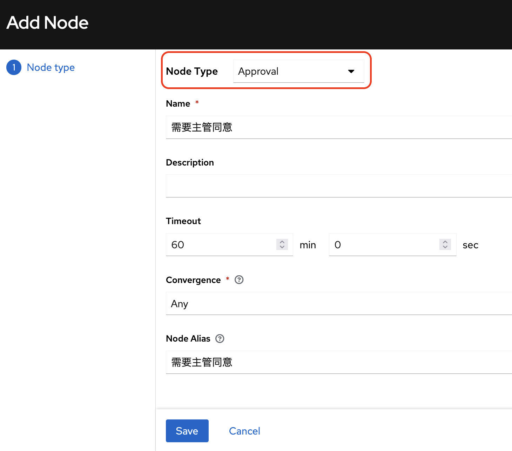
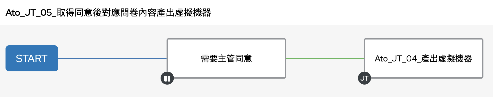
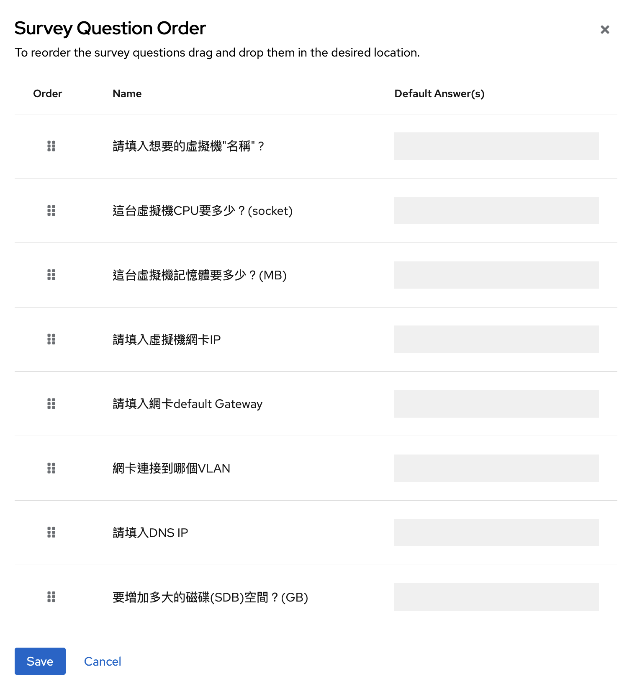

# 1. Infrastructure Demos - 服務或開發環境搭建

預期結果：透過標準化的配置將遠程主機或虛擬機實現系統管理任務的自動化
        其中本次測試驗證加入 
1. Survey(問卷調查)
2. Approval(審批)機制

---

- 環境需求：測試環境需要有vCenter, ESXi, 及需要預先準備一個RHEL VM Template

在本次測試環境許用vCenter與ESXi 6.7 版, 並預先準備一個RHEL 7 模板。

測試方式由模擬VM需求同事，透過AAP點擊執行並填入VM客製化內容

如：

* 主機名稱

* CPU

* Memory

* IP等相關資訊

輸入完成後, 主管審批取得同意後執行自動化部署虛擬伺服器

- 注意事項：測試環境為求簡便, 帳號密碼為明碼, 請用在測試環境，如須整合客戶環境, 可用Vault將機敏資料加密。

---
1. 預先把寫好的腳本從YAML檔變成AAP的Job template(JT) 位至於左邊Template處
2. 位於template > add > Workflow template 
- 選定產出VM的JT, 並再之前新增一個approval node 如下圖

## Workflow ＋ 審批機制

## 問卷表單

- 虛擬機名稱 >> vm_name
- CPUs >> num_cpus
- memorys >> memory_mb
- IP >> guest_ip
- GW >> guest_gateway
- VLAN >> vlan_name
- DNS >> dns_server
- disk size >> SDB_SIZE

新增Survey時有兩點要特別注意

1. Survey需要再Workflow內新增而不是從JT裡面新增Survey

2. 注意Question為問題, 可以用繁中, Answer Variable name需要對應playbook內vars的名稱 

## Reference:
    - https://www.ansiblepilot.com/articles/create-a-vmware-vsphere-virtual-machine-ansible-module-vmware_guest/
    - https://github.com/lucab85/ansible-pilot/
    - https://github.com/ZioGuillo/vm-vsphere-ansible